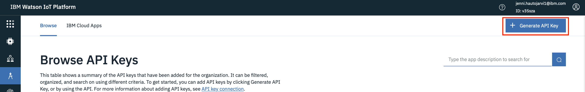
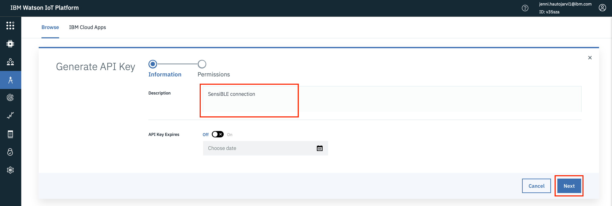
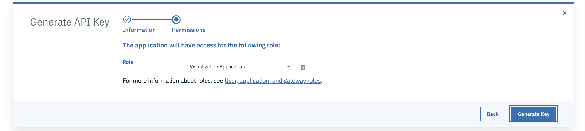
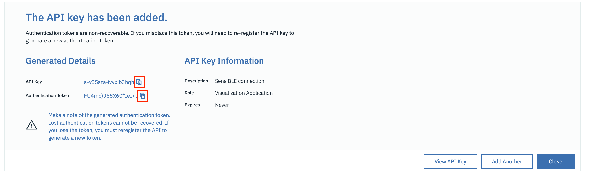
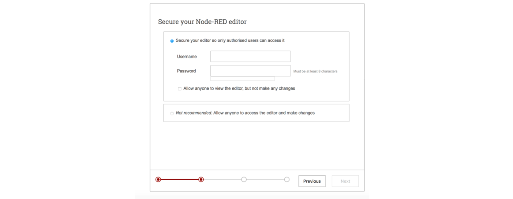
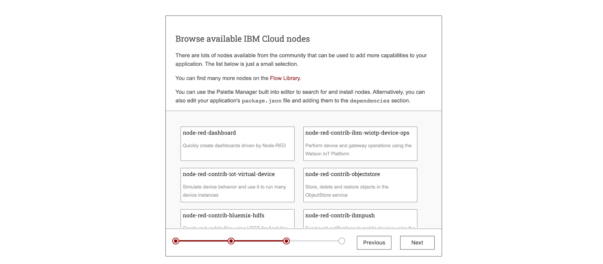
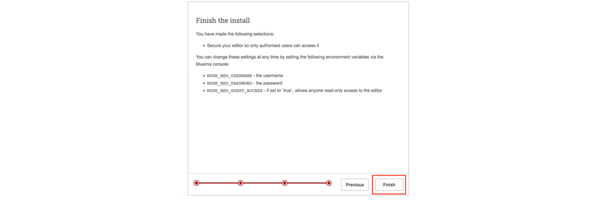
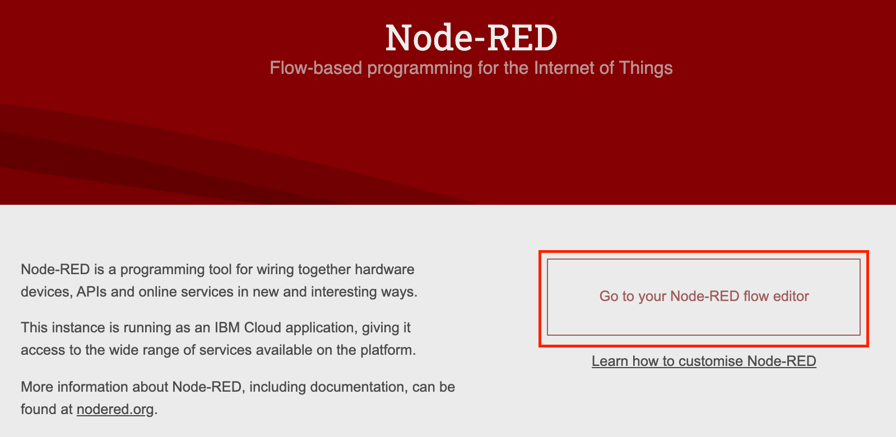
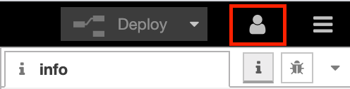
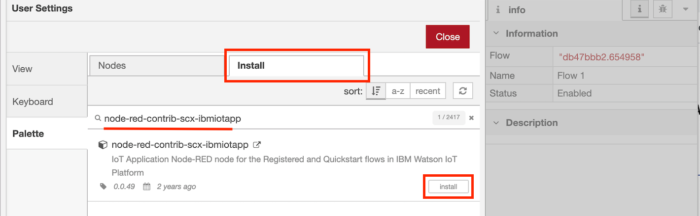

# _**Watson IoT platform**_ Lab

## Introduction
In this guide, Step by Step we connect SensiEDGE’s SensiBLE to IBM Watson IoT Platform in IBM Cloud and visualises data in the Node-RED application.

### Prerequisites
- [IBM Cloud](https://cloud.ibm.com) account
- Sensor, In this lab we use SensiEDGE’s SensiBLE

# Step 1. Connect SensiEDGE’s SensiBLE to ST BLUEMS APP to read data

### SensiEDGE’s SensiBLE

The SensiBLE “IoT Hardware Ready” allows quick and easy prototyping of IoT devices

#### Key Features
- 0 to 100% relative humidity range
- Supply voltage: 1.7 to 3.6 V
- Low power consumption: 2 μA @ 1 Hz ODR
- Selectable ODR from 1 Hz to 12.5 Hz
- High rH sensitivity: 0.004% rH/LSB
- Humidity accuracy: ± 3.5% rH, 20 to +80% rH
- Temperature accuracy: ± 0.5 °C,15 to +40 °C
- Embedded 16-bit ADC
- 16-bit humidity and temperature output data
- I²C interfaces
- Factory calibrated

## Download & Install ST BLUEMS APP and connect SensiBLE

After downloading the app insert battery into the SensiBLE. Red led should light up in SensiBLE. Open application and click **Connect to a device**. Select your **device** from list by clicking it. Now you should see data from your device and the led should be green. (_The application layout might be different using Android_)

Now your SensiBLE devices is connected to your phone. **When you close the app the connection closes and the led is red.** To reconnect open the app and bush the button in SensiBLE side.

********************

# Step 2. Create Watson IoT Platform and connect SensiBLE

## Create Watson IoT Platform

In this section we are going to create a **_Watson IoT Platform_** instance on IBM Cloud, and use it to connect SensiBLE device to receive data.

**(1)** Log into IBM Cloud and create a **_Watson IoT Platform_** service.
- Click on `Catalog`, then filter by clicking on `Internet of Things`
- Select `Internet of Things Platform`

**(2)** Create the service with a unique name: we'd suggest something like `Internet of Things Platform-eventname-yourinitials`, e.g. `Internet of Things Platform-workshop-JH`

Ensure you are using the `Lite` plan.

Scroll down and give the service name you want, then hit `Create`.

**(3)** Click on `Launch`.

**(4)** You might need to sing in using your **IBM Cloud Username and Password**.

**(5)** Click your name in upper right corner.

**(6)** Select organization by clicking it.

#### **Now you are ready to connect your device. Nice work!**

## Connect SensiBLE to Watson IoT Platform

**(1)** Click `Add Device`.

**(2)** From ST BLUEMS APP you need to find Device Type and Device Id.

**(3)** Add Device Type and Device ID from App and click `Next`.

**(4)** Next you can add metadata but now we skip this part and click `Next`.

**(5)** You can write your own **Authentication Token** example "Sensi2901" and click `Next`.

**(6)** Now you can see summary of your device. Open ST BLUEMS APP and add **Organization** (from upper right corner, after ID: "This is organization") and **Authentication Token** (you just write it) information into the APP.

## **Kuva tähän vielä**

If the information is correct in Watson IoT Platform, click `Finnish`.

**(7)** Now you can click `Connect` from the APP and select Humidity and Temperature.

From IBM IoT Platform you can see in `Recent Events` section the data from SensiBLE.

**You have now connected SensiBLE to IBM IoT Platform. Good job!**

**(8)** We need to create API Key and API Token for creating connection to Node-Red.

From left menu click `Apps`

Click `Generate API Key`

Add information about the connection and click `Next`

Check role and click `Generate Key`

Here you can copy API Key and API Token. **After closing this you can't see the API Token anymore!**

******************************

# Step 3. Create Node-Red dashboard and connect Watson IoT Platform to visualize data

## Create Node-Red app from catalog

**About Node-RED**

Node-RED is a visual tool for wiring the internet of things - connecting hardware devices, APIs and online services in a new and interesting way. Node-RED provides a browser-based flow editor that makes it easy to wire together flows using the wide range nodes in the palette. Flows can be then deployed to the runtime in a single-click.

- JavaScript functions can be created within the editor using a rich text editor.
- A built-in library allows you to save useful functions, templates or flows for re-use.
- See [https://nodered.org](https://nodered.org) for more information.

**If you have running Node-Red application in IBM Cloud you can skip this and use that.**

**(1)** Go back IBM Cloud and create a **_Node-Red Cloud Foundry App_** service.
- Click on `Catalog` and `Software`, then write in search field **node-red**
- Select `Node-RED Starter`

**(2)** Create the app with a unique name.

Ensure you are using the `Lite` plan.

Scroll down and give the app name you want, then hit `Create`. This name will show in the address of our app, http://yourAppName.eu-gb.mybluemix.net/ui.

**(3)** Click on `Visit App URL`.

**(4)** Configure your Node-RED editor.

In this section, you will set up a username and password to protect your flow. Click `Next`.

Write an username and a password of your choice and click `Next`. Remember that it does not have to be related to your IBM Cloud access.

Node-RED is an open source project so you can add new nodes to the palette by modifying the package.json file. Click `Next`.

**Your Node-RED flow is all set!**

**(5)** Now click `Go to your Node-RED flow editor` to open the flow editor and enter your credentials to access the editor.

When using Node-RED we build our apps using this graphical editor interface to wire together the blocks we need. We can simply drag and drop the blocks from the left menu into the workspace in the center of the screen and connect them to create a new flow.

Note: If you get an "Authorization denied" message when deploying your applications make your sure you are logged in. Click on the icon on the top right side of the Node-RED canvas and login with the credentials you created in the previous steps.

## Build your Node-RED flow to show IoT data Dashboard

**(1)** First we will add some new nodes to our palette.

In the Node-RED window click on the three lines (burger menu) on the top right corner and in the menu, click on the `Manage palette`. This will open the node menu where you can add new nodes to your application.

You will see the nodes that are installed by default and if you go to the 'install' tab you can search for any node package and add it directly to your app.

Install 2 packages:
- node-red-contrib-scx-ibmiotapp
- node-red-dashboard

This will prompt a window to confirm the installation. Click on install and wait few minutes, the application may require a restart. Click "Done" to close the left side menu.

After few minutes you will see the new nodes in your Node-RED palette.

Repeat for another package.

**(2)** In order to make the lab easier we are going to import the rest of the code.

You can get the complete Node-RED flow from the Hamk-IoT-Dashboard.json.

Import the flow by simply clickcing on the 3 white lines on the top right corner of the Node-RED window. Click `Import` and paste the text you copied from above. Click `Import`.

Now your flow should look like this:

**(3)** Add information to IoT-node connecting IBM IoT Platform to Node-Red.

You will need to do some editing on IoT node, because credentials are not transferred with the rest of the code. Edit the blue IBM IoT node with:
- your own credentials (API Key and API Token from IBM IoT Platform)
- change SensiBLE Device Id correct one (you can find this from IBM IoT Platform or from ST BLUEMS APP)

Bouble-click IBM IoT node

Change Device Id and click pen icon next to API Key

Add API Key and API Token from IBM IoT Platform. Click `Update`.

When you have make all the changes to this node, click `Done`.

**(4)** View Dashboard UI
Now, first click `dashboard-button` from upper right corner and then click `Deploy`. Everytime `Deploy` is red there are changes in the flow that has not been update. Next click link to access ui.

New Tab opens and now you can see your data from SensiBLE in Node-Red Dashboard.

If there is no data flow:
- Check that your devices is connected to mobile App
- Check from IBM IoT Platform Device Event part that you are receiving data. There should be continues data flow.
- Check from Node-Red debug (button next to dashboard button) that you are receiving data.

# Summary

In this lab you created connection between SensiBLE and Watson IoT platform and visualised the data in a dashboard using Node-RED.
