# _**Watson IoT platform**_ Lab

## Introduction
In this guide, Step by Step we connect SensiEDGE’s SensiBLE to IBM Watson IoT Platform in IBM Cloud and visualises data in the Node-RED application.

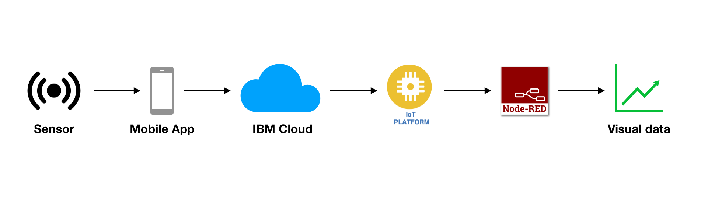

### Prerequisites
- [IBM Cloud](https://cloud.ibm.com) account
- Sensor, In this lab we use SensiEDGE’s SensiBLE

# Step 1. Connect SensiEDGE’s SensiBLE to ST BLUEMS APP to read data

### SensiEDGE’s SensiBLE

The SensiBLE “IoT Hardware Ready” allows quick and easy prototyping of IoT devices

#### Key Features
- 0 to 100% relative humidity range
- Supply voltage: 1.7 to 3.6 V
- Low power consumption: 2 μA @ 1 Hz ODR
- Selectable ODR from 1 Hz to 12.5 Hz
- High rH sensitivity: 0.004% rH/LSB
- Humidity accuracy: ± 3.5% rH, 20 to +80% rH
- Temperature accuracy: ± 0.5 °C,15 to +40 °C
- Embedded 16-bit ADC
- 16-bit humidity and temperature output data
- I²C interfaces
- Factory calibrated

## Step 1.1 Download & Install ST BLUEMS APP and connect SensiBLE

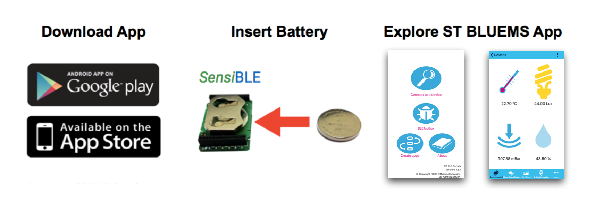

After downloading the app insert battery into the SensiBLE. Red led should light up in SensiBLE. Open application and click **Connect to a device**. Select your **device** from list by clicking it. Now you should see data from your device and the led should be green. (_The application layout might be different using Android_)

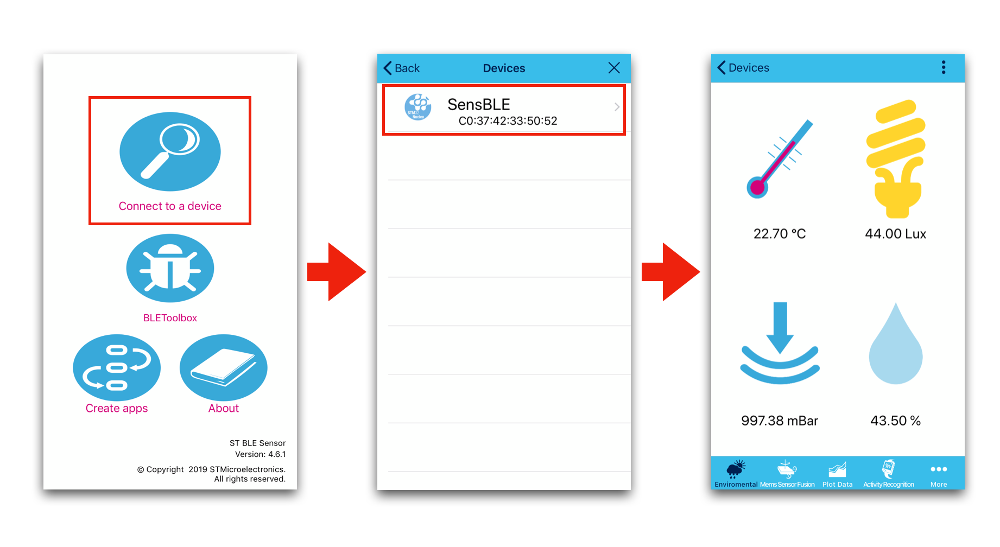

Now your SensiBLE devices is connected to your phone. **When you close the app the connection closes and the led is red.** To reconnect open the app and bush the button in SensiBLE side.

# Step 2. Create Watson IoT platform and connect SensiBLE

## Create Watson IoT platform

In this section we are going to create a **_Watson IoT platform_** instance on IBM Cloud, and use it to connect SensiBLE device to receive data.

**(1)** Log into IBM Cloud and create a **_Watson IoT platform_** service.
- Click on `Catalog`, then filter by clicking on `Internet of Things`
- Select `Internet of Things Platform`

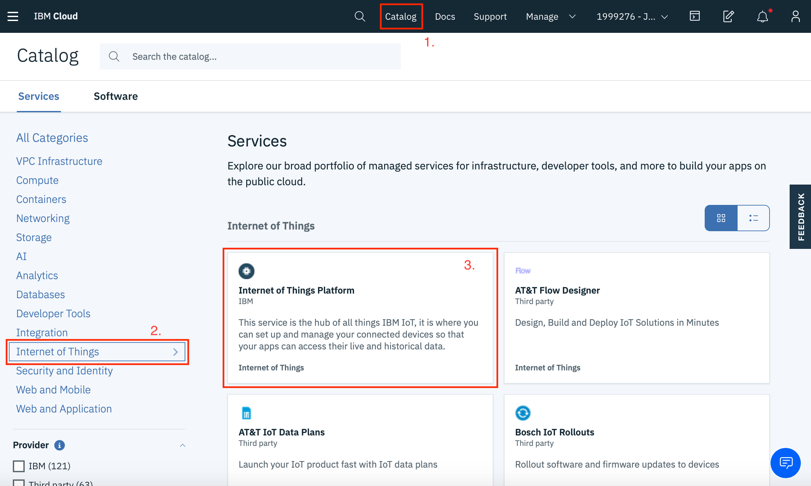

**(2)** Create the service with a unique name: we'd suggest something like `Internet of Things Platform-eventname-yourinitials`, e.g. `Internet of Things Platform-workshop-JH`

Ensure you are using the `Lite` plan.

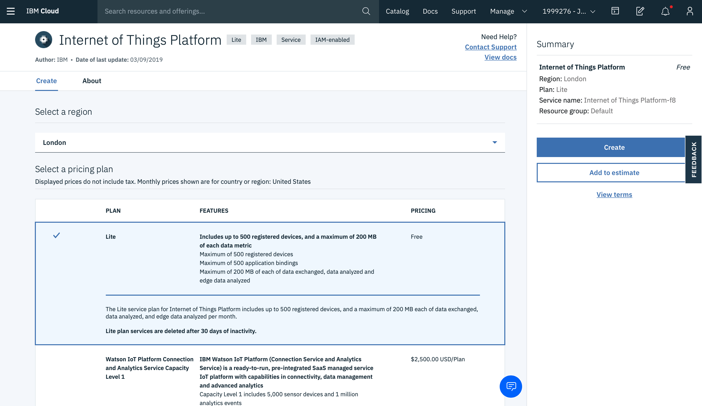

Scroll down and give the service name you want, then hit `Create`.

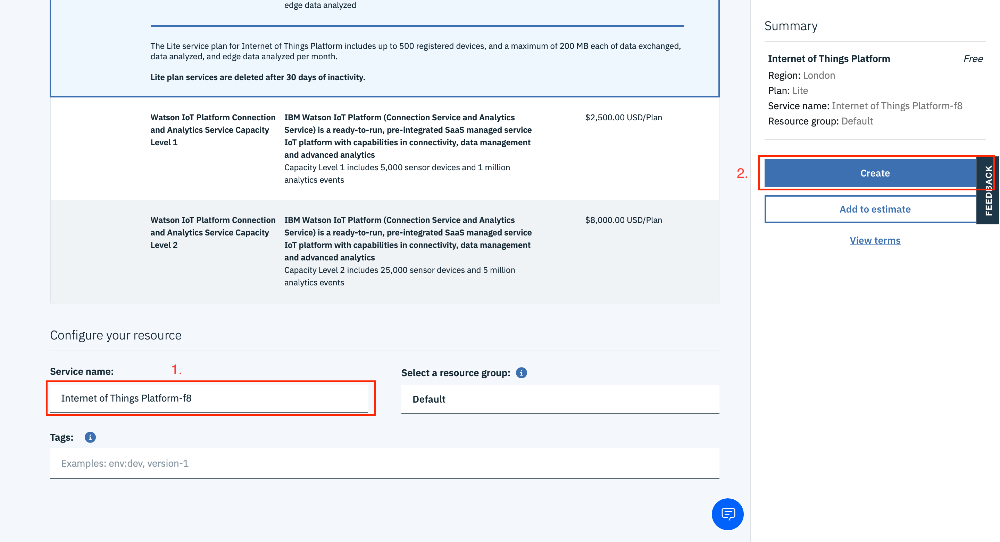

**(3)** Click on `Launch`.

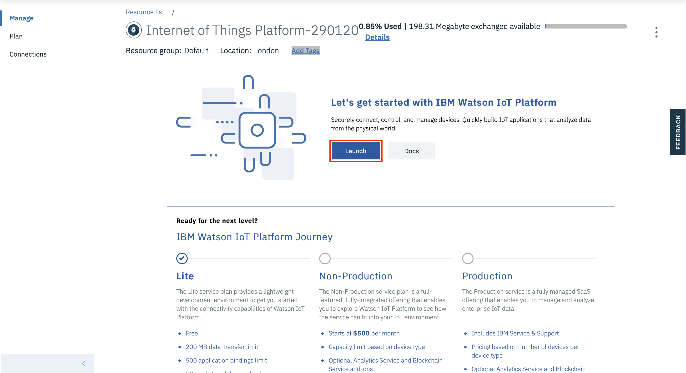

**(4)** You might need to sing in using your **IBM Cloud username and password**.

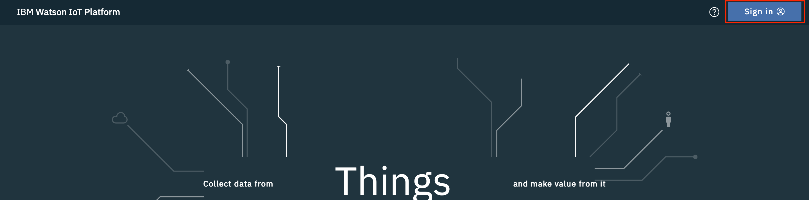

**(5)** Click your name in upper right corner.

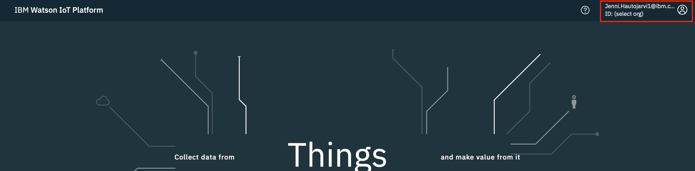

**(6)** Select IoT account by clicking it.

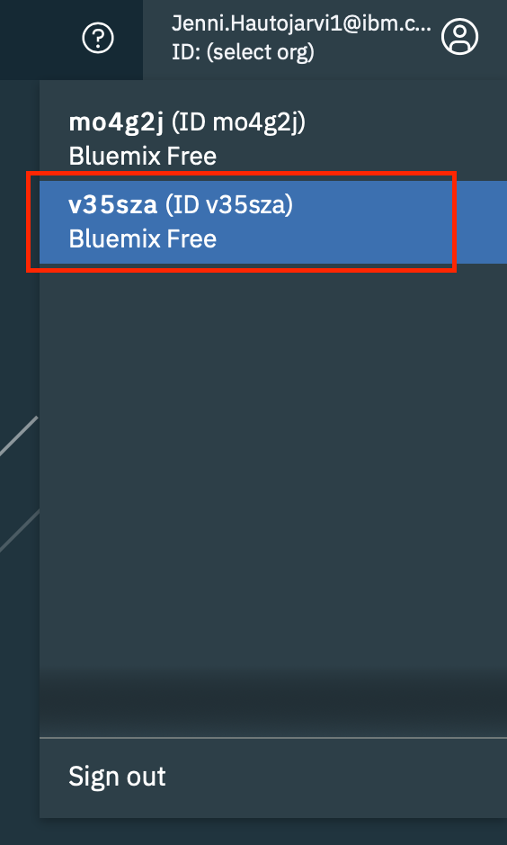

#### **Now you are ready to connect your device**

## Connect SensiBLE to Watson IoT platform

**(1)** Click `Add Device`.

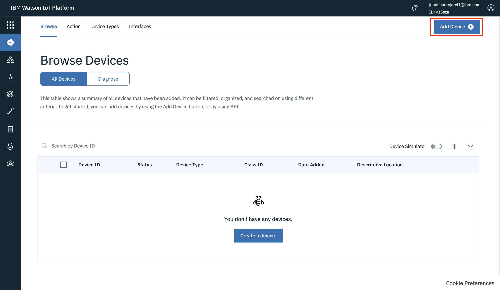

**(2)** lisää tiedot puhelimesta tee kuva jossa näytettään flow.

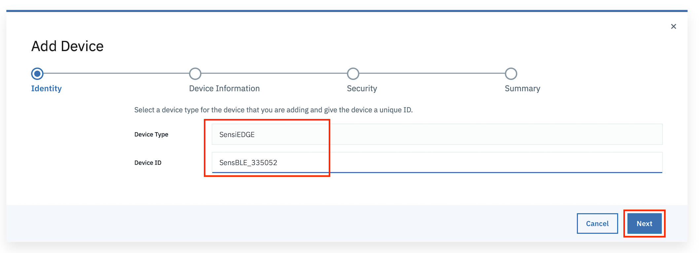

**(3)** Add Device Type and Device ID and click `Next`.

**(4)** Next you can add metadata but now we skip this part and click `Next`.

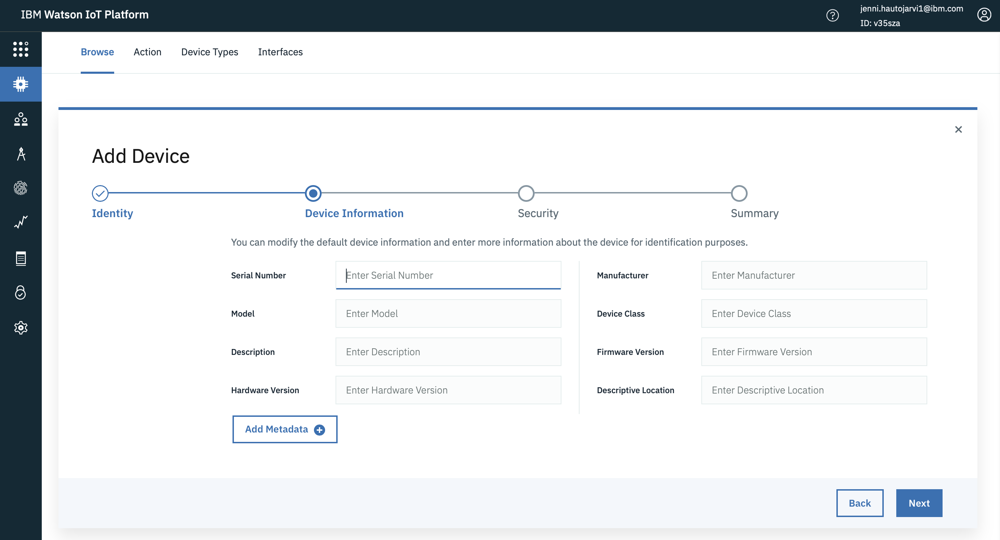

# Step 3. Create Node-Red dashboard and connect Watson IoT Platform for visualises data

# Summary

In this lab you created connection between SensiBLE and Watson IoT platform and visualised the data in a dashboard using Node-RED.
