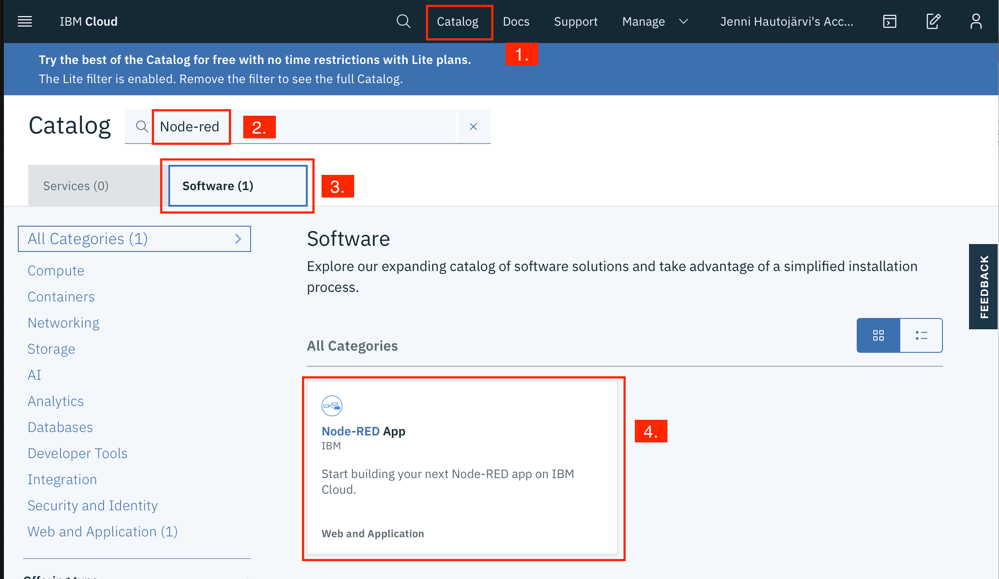

# _**Watson IoT platform**_ Lab

## Introduction
In this guide, Step by Step we connect SensiEDGE’s SensiBLE to IBM Watson IoT Platform in IBM Cloud and visualises data in the Node-RED application.

### Prerequisites
- [IBM Cloud](https://cloud.ibm.com) account
- Sensor, In this lab we use SensiEDGE’s SensiBLE

# Step 1. Connect SensiEDGE’s SensiBLE to ST BLUEMS APP to read data

### SensiEDGE’s SensiBLE

The SensiBLE “IoT Hardware Ready” allows quick and easy prototyping of IoT devices

#### Key Features
- 0 to 100% relative humidity range
- Supply voltage: 1.7 to 3.6 V
- Low power consumption: 2 μA @ 1 Hz ODR
- Selectable ODR from 1 Hz to 12.5 Hz
- High rH sensitivity: 0.004% rH/LSB
- Humidity accuracy: ± 3.5% rH, 20 to +80% rH
- Temperature accuracy: ± 0.5 °C,15 to +40 °C
- Embedded 16-bit ADC
- 16-bit humidity and temperature output data
- I²C interfaces
- Factory calibrated

## Download & Install ST BLUEMS APP and connect SensiBLE

After downloading the app insert battery into the SensiBLE. Red led should light up in SensiBLE. Open application and click **Connect to a device**. Select your **device** from list by clicking it. Now you should see data from your device and the led should be green. (_The application layout might be different using Android_)

Now your SensiBLE devices is connected to your phone. **When you close the app the connection closes and the led is red.** To reconnect open the app and bush the button in SensiBLE side.

********************

# Step 2. Create Watson IoT Platform and connect SensiBLE

## Create Watson IoT Platform

In this section we are going to create a **_Watson IoT Platform_** instance on IBM Cloud, and use it to connect SensiBLE device to receive data.

**(1)** Log into IBM Cloud and create a **_Watson IoT Platform_** service.
- Click on `Catalog`, then filter by clicking on `Internet of Things`
- Select `Internet of Things Platform`

**(2)** Create the service with a unique name: we'd suggest something like `Internet of Things Platform-eventname-yourinitials`, e.g. `Internet of Things Platform-workshop-JH`

Ensure you are using the `Lite` plan.

Scroll down and give the service name you want, then hit `Create`.

**(3)** Click on `Launch`.

**(4)** You might need to sing in using your **IBM Cloud Username and Password**.

**(5)** Click your name in upper right corner.

**(6)** Select organization by clicking it.

#### **Now you are ready to connect your device. Nice work!**

## Connect SensiBLE to Watson IoT Platform

**(1)** Click `Add Device`.

**(2)** From ST BLUEMS APP you need to find Device Type and Device Id.

**(3)** Add Device Type and Device ID from App and click `Next`.

**(4)** Next you can add metadata but now we skip this part and click `Next`.

**(5)** You can write your own **Authentication Token** example "Sensi2901" and click `Next`.

**(6)** Now you can see summary of your device. Open ST BLUEMS APP and add **Organization** (from upper right corner, after ID: "This is organization") and **Authentication Token** (you just write it) information into the APP.

## **Kuva tähän vielä**

If the information is correct in Watson IoT Platform, click `Finnish`.

**(7)** Now you can click `Connect` from the APP and select Humidity and Temperature.

From IBM IoT Platform you can see in `Recent Events` section the data from SensiBLE.

**You have now connected SensiBLE to IBM IoT Platform. Good job!**

******************************

# Step 3. Create Node-Red dashboard and connect Watson IoT Platform for visualises data

## Create Node-Red app from catalog

**About Node-RED**

Node-RED is a visual tool for wiring the internet of things - connecting hardware devices, APIs and online services in a new and interesting way. Node-RED provides a browser-based flow editor that makes it easy to wire together flows using the wide range nodes in the palette. Flows can be then deployed to the runtime in a single-click.

- JavaScript functions can be created within the editor using a rich text editor.
- A built-in library allows you to save useful functions, templates or flows for re-use.
- See [https://nodered.org](https://nodered.org) for more information.

**If you have running Node-Red application in IBM Cloud you can skip this and use that.**

**(1)** Go back IBM Cloud and create a **_Node-Red Cloud Foundry App_** service.
- Click on `Catalog` and `Software`, then write in search field **node-red**
- Select `Node-RED Starter`

**(2)** Create the app with a unique name: we'd suggest something like `Internet of Things Platform-eventname-yourinitials`, e.g. `Internet of Things Platform-workshop-JH`

Ensure you are using the `Lite` plan.

Scroll down and give the app name you want, then hit `Create`. This name will show in the address of our app, http://yourAppName.eu-gb.mybluemix.net/ui.

**(3)** Click on `Visit App URL`.

## Add image how to built node-red app....

*******

## Build your Node-RED flow to show IoT data Dashboard

Add nodes:

Copy dashboard.txt file from github. **Click** in Node-Red upper right corner "burger menu" and `Import` part. Paste text you just have copy from github and click `Import`.

**kuva tähän**

Add information to IoT-node connecting IBM IoT Platform to Node-Red.

**Kuva tähän**

Now click `Deploy` from upper right corner and click link to access ui. New Tab opens and now you can see your data from SensiBLE in Node-Red Dashboard.

# Summary

In this lab you created connection between SensiBLE and Watson IoT platform and visualised the data in a dashboard using Node-RED.
